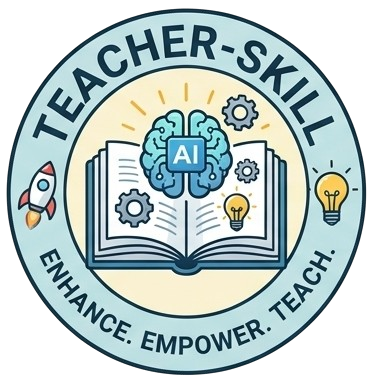
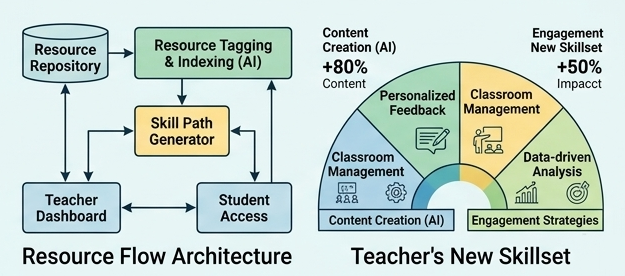
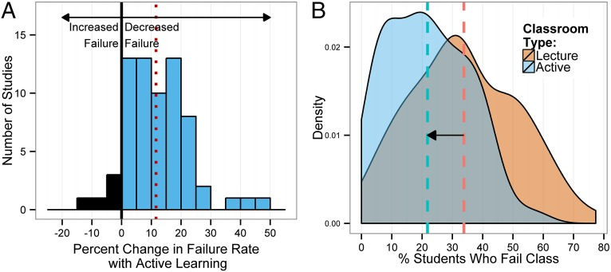
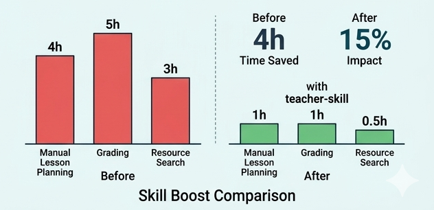

# Super Teacher for Claude Code

[English](./README.md) | [中文](./README.zh-CN.md)

**A 300-line teaching workflow that turns AI from an answer machine into a Socratic tutor.**

<p align="center">
  
</p>

Traditional tutoring (1:1, 1:many) and most LLM Q&A do the same thing: compress knowledge and dump it to users. It feels efficient, but retention is weak.

This skill uses evidence-based learning strategies (retrieval practice, interleaving, dual coding, self-explanation, metacognition, and Socratic questioning) to force active thinking and improve transfer.

Research anchor: Freeman et al. (2014), *Active learning increases student performance in science, engineering, and mathematics*, *PNAS* 111(23), 8410-8415.  
https://www.pnas.org/doi/10.1073/pnas.1319030111

<p align="center">
  <a href="https://github.com/caapapx/teacher-skill">GitHub</a> · <a href="https://github.com/caapapx/teacher-skill/issues">Issues</a>
</p>

---

## Quick Start

Pick your runtime and copy one folder:

```bash
# Claude Code
cp -r teacher-cs/claude your-project/.claude/skills/teacher-cs

# Codex
cp -r teacher-cs/codex your-project/.codex/skills/teacher-cs

# Cursor
cp -r teacher-cs/cursor your-project/.cursor/skills/teacher-cs
```

For the generic version (not CS-only), copy `teacher/` to your runtime's skills path.

After install, ask questions as usual. The skill takes over the teaching flow automatically.

---

## System Architecture (At a Glance)

The architecture below shows how resources are indexed, converted into adaptive skill paths, and fed back through teacher/student loops.



---

## Passive vs Active Teaching

| Dimension | Passive mode (typical prompt) | Active mode (`teacher-skill`) |
|---|---|---|
| Can the user restate definitions? | Usually | Yes |
| Can the user solve new problems? | Unreliable | Significantly better |
| Can the system detect misconceptions? | Weak | Strong |
| User-generated output during session | Minimal | Required |
| Adaptive to user level | Often no | Built in |

Core result: active learning improves exam performance by about **0.47 SD**, and lecture-only settings show much higher failure risk (Freeman et al., 2014).



Operational impact snapshot (workflow efficiency):



---

## Seven Teaching Modes

| Mode | Name | What it does | Typical trigger |
|---|---|---|---|
| A | Guided Decomposition | Stepwise breakdown and manual trace | Algorithms, math derivations, case analysis |
| B | Socratic + Advanced Retrieval | Question chains for deep understanding | Interview prep, concept deep dive |
| C | Mental Model + Dual Coding | Explain abstract ideas with text + visuals | System design, scheduling, Transformer |
| D | Simplification + Analogy | Translate jargon into beginner language | Intro concepts, "what is X?" |
| E | Deep Inquiry | Iterative why/how/boundary probing | Mechanism and causality questions |
| F | Interleaving + Generative Learning | Mixed drills + summaries/flashcards/analogies | "Learn X systematically" |
| G | Metacognitive Strategy | Diagnose learning bottlenecks | Low retention, stuck learning |

Routing adapts by time budget, answer style, interaction intensity, and baseline level.

---

## Evidence Base

| Method | Source | Key finding |
|---|---|---|
| Active learning | https://www.pnas.org/doi/10.1073/pnas.1319030111 | +0.47 SD effect size |
| Retrieval practice | https://journals.sagepub.com/doi/10.1111/j.1467-9280.2006.01693.x | Recall beats re-reading |
| Interleaving | https://www.tandfonline.com/doi/abs/10.1080/00220970709598675 | Mixed practice > blocked practice |
| Dual coding | https://files.eric.ed.gov/fulltext/ED340377.pdf | Words + visuals > words only |
| Self-explanation | https://www.taylorfrancis.com/chapters/edit/10.4324/9780203052860-13/ | Active explanation improves outcomes |
| Metacognition | https://psycnet.apa.org/record/1980-09388-001 | Monitoring understanding is trainable |
| Socratic questioning | https://link.springer.com/article/10.1007/BF02310573 | Guided inquiry outperforms direct telling |
| Learning-techniques review | https://journals.sagepub.com/doi/10.1177/1529100612453266 | Retrieval/interleaving are high-utility |

---

## Knowledge Source Priority

```
User-provided material (notes, textbooks, code)
  -> if insufficient
Web search (latest docs, APIs, breaking changes)
  -> if unavailable
RAG / local knowledge base
  -> if not configured
Model internal knowledge
```

User material is always first priority.

---

## `teacher` vs `teacher-cs`

| Skill | Scope | Optimization |
|---|---|---|
| [`teacher`](./teacher/) | Any domain | Concept formation, review, guided drills |
| [`teacher-cs`](./teacher-cs/) | Computer science | Algorithm tracing, system design, interview training, visual pedagogy |

`teacher-cs` adds:

- Algorithm state-snapshot tracing
- CS domain adapters (Go, algorithms, systems, AI, interviews)
- Interactive HTML visualizations
- Visualization decision tree (ASCII -> Mermaid -> HTML)

---

## Runtime Matrix

| Runtime | Path | Notes |
|---|---|---|
| Claude Code | [`teacher-cs/claude/`](./teacher-cs/claude/) | Full package: evals + knowledge sources + viz patterns |
| Codex | [`teacher-cs/codex/`](./teacher-cs/codex/) | Includes `agents/openai.yaml` |
| Cursor | [`teacher-cs/cursor/`](./teacher-cs/cursor/) | Lean package with core teaching logic |

---

## Repo Structure

```text
teacher-skill/
├── README.md
├── README.zh-CN.md
├── CONTRIBUTING.md
├── teacher/
│   ├── SKILL.md
│   ├── references/
│   └── evals/
└── teacher-cs/
    ├── evals/
    ├── claude/
    │   ├── SKILL.md
    │   ├── references/
    │   └── evals/
    ├── codex/
    │   ├── SKILL.md
    │   ├── agents/
    │   └── references/
    └── cursor/
        ├── SKILL.md
        └── references/
```

---

## Real Teaching Scenarios

- "How do I solve Two Sum?" -> Mode A, outputs variable table + step snapshots + self-checks, not direct final code.
- "Redis persistence interview prep" -> Mode B, baseline probe + multi-layer question chain.
- "Explain Transformer attention" -> Mode C, matrix-style visual + explanation + checks.
- "Systematically learn distributed systems" -> Mode F, time-boxed plan + mixed drills + generative tasks.

---

## TODO

- [ ] More domain adapters (medicine, law, finance)
- [ ] Expand eval cases (5 -> 20+)
- [ ] Cross-runtime consistency tests
- [ ] Visualization template expansion
- [ ] Learning-progress tracking

---

## Contributing

See [CONTRIBUTING.md](./CONTRIBUTING.md). Typical contribution paths:

1. Add a new domain adapter in `references/domain-<name>.md`
2. Add eval cases in `evals/evals.json`
3. Improve teaching logic in `SKILL.md`
4. Extend knowledge sources with MCP server + `references/source-<type>.md`

---

## License

MIT
